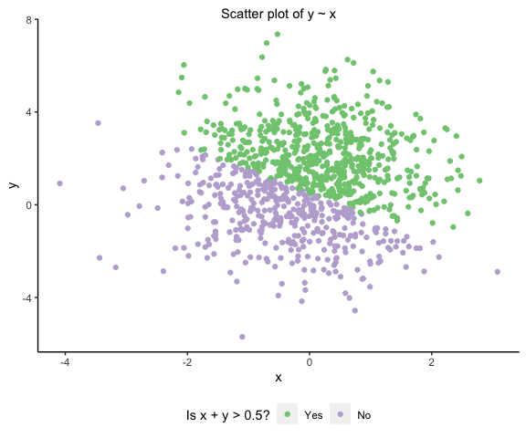

PUBH 7462 Homework 1
================
Jack Rabe
1/31/2022

-   [Preamble](#preamble)
-   [Problem 2. Best Practices and Consistent
    Style](#problem-2-best-practices-and-consistent-style)
    -   [Problem 2.1 Independent Bivariate Normal Random
        Sample](#problem-21-independent-bivariate-normal-random-sample)
    -   [Problem 2.2 Penguin EDA](#problem-22-penguin-eda)
        -   [Problem 2.2.1 Data
            Description](#problem-221-data-description)
        -   [Problem 2.2.2 Visualization](#problem-222-visualization)

# Preamble

This report contains answers to two problems for PUBH 7462 Homework 1.
The first problem focuses on best practices and style in R by using the
tidyverse to make some simple data transformations to a random sample
and plotting the results on a basic scatter plot. The second problem
involves some EDA with a data set containing measurements of penguins
captured in Antarctica.

# Problem 2. Best Practices and Consistent Style

## Problem 2.1 Independent Bivariate Normal Random Sample

``` r
#create a tibble with two randomly sampled variables based on normal distributions and a third logical variable based on the summation of the two random variables
normsum.df <- tibble(
x = rnorm(1000, mean = 0, sd = 1), 
y = rnorm(1000, mean = 1, sd = 2),
sum_indicator = ifelse(x + y > 0.5, TRUE, FALSE)
)

#mutate sum_indicator variable into a factor with two levels, "yes" and "no," with "yes" preceding "no"
#using tidyverse
normsum.df <- normsum.df %>% 
  mutate(sum_indicator = as.factor(ifelse(sum_indicator == TRUE, "Yes", "No")))

normsum.df$sum_indicator <- forcats::fct_relevel(normsum.df$sum_indicator, "Yes") # reorder so "Yes" comes before "No"

#check that it worked  
str(normsum.df)
```

``` r
#Now lets plot the data
ggplot(data = normsum.df, aes(x = x, y = y, color = sum_indicator)) +
  geom_point() +
  labs(title = "Scatter plot of y ~ x") +
  scale_color_brewer(palette = "Accent", "Is x + y > 0.5?" )
```



## Problem 2.2 Penguin EDA

``` r
#load in the data
penguin.df <- read_rds("./data/penguin.RDS")
```

### Problem 2.2.1 Data Description

Each observation in the **penguins** data set represents size
measurements for adult foraging penguins near Palmer Station,
Antarctica.

There are 344 observations in the **penguins** data set with 8
variables.

The variables are as follows:

-   *species* of course refers to the species (Adelie, Chinstrap,
    Gentoo) of penguin being measured

-   *island* refers to the island (Biscoe, Dream, Torgersen) the penguin
    was captured on

-   *bill_length_mm* refers to the bill length in millimeters of the
    penguin being measured

-   *bill_depth_mm* refers to the bill depth in millimeters of the
    penguin being measured

-   *flipper_length_mm* refers to the flipper length in millimeters of
    the penguin being measured

-   *body_mass_g* refers to the body mass in grams of the penguin being
    measured

-   *sex* refers to the sex (female, male) of the penguin being measured

The mean flipper length (mm) of measured penguins is 200.9 with a
standard deviation of 14.1.

The mean bill length (mm) of measured penguins is 43.9 with a standard
deviation of 5.5.

### Problem 2.2.2 Visualization

``` r
#lets generate a plot comparing bill length with flipper length across species
peng_flipbill.gg <- penguin.df %>% 
ggplot(aes(x = bill_length_mm, y = flipper_length_mm)) +
  geom_point(aes(color = species)) +
  labs(title = "Relationship between bill length and flipper length \nin adult penguins near Palmer Station, Antarctica",
       x = "Bill length (mm)",
       y = "Flipper length (mm)") +
  scale_color_brewer(palette = "Dark2", "Species")
  
peng_flipbill.gg  
```


In general, broad trends indicate that as penguin bill length increases,
so to does flipper length. However, there’s quite a bit of variation
between species. For instance, Adelie penguins tend to have much shorter
bills that Chinstrap or Gentoo penguins. Adelie penguins also have the
shortest flippers, however, Chinstrap penguins appear to have very short
flippers as well. Interestingly, while Chinstrap penguins have short
flippers, they have very long bills. Gentoo penguins have the longest
flippers and a similar bill length to Chinstrap penguins.

What I find most fascinating, is that there’s very little overlap
between penguin species when looking at bill length and flipper length
together, which could suggest why they are classified as distinct
species and that there could be some really cool underlying reasons for
such morphological differences, like niche partitioning (e.g., Galapagos
finches and tortoises).

``` r
#now create the same plot but add sex
peng_flipbill.gg +
  facet_wrap(~sex)
```


Again, we see the same patterns as described in the previous plot in
terms of species differences. What this plot demonstrates is that female
penguins have consistently shorter bills and flippers than male
penguins. We also see that sex was not determined for a few individuals,
so we could redo this plot without NAs to only compare known males and
females.
